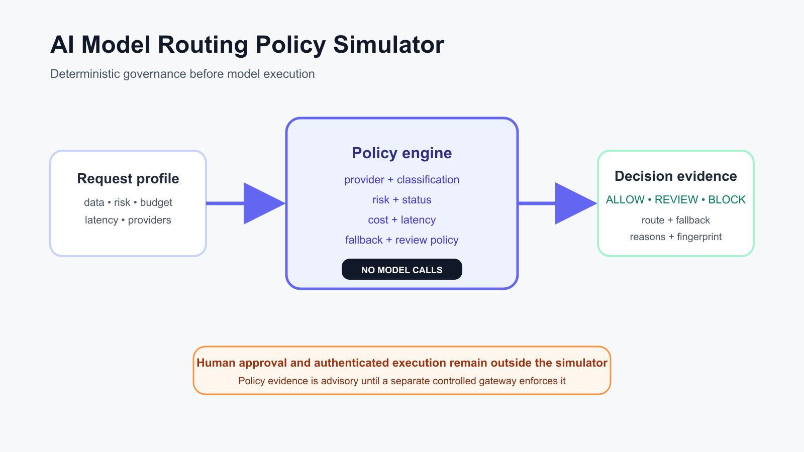

# AI Model Routing Policy Simulator

A deterministic, explainable policy layer for deciding whether an AI request may use a model route. The simulator evaluates data classification, task risk, provider approval, cost, latency, model status, and fallback availability before returning `ALLOW`, `REVIEW`, or `BLOCK`.



## Why this project exists

AI orchestration often treats model choice as a performance or cost optimization. In an enterprise, it is also a governance decision: the selected provider and model must be appropriate for the data, risk, budget, and recovery requirements of the request. This project makes that decision reproducible before any model is called.

## What it demonstrates

- Policy-as-code for AI orchestration and provider governance
- Deterministic model selection with stable tie-breaking
- Explicit cost and latency budget enforcement
- Human-review gates for sensitive data and missing fallbacks
- Explainable rejection codes and audit fingerprints
- Offline tests, CI, Docker packaging, and an inactive n8n integration template

## Safety boundary

This is a simulator. It calls no LLM, cloud API, or external provider; reads no credentials; sends no data; and executes no routed workload. `ALLOW` means only that the supplied evidence satisfies the sample policy. A separate, authenticated executor and human approval process are required for real production use.

## Run locally

```bash
python -m venv .venv
source .venv/bin/activate
python -m pip install -e .
python -m ai_model_routing_policy_simulator --input examples/routing-request.json
```

Run the tests:

```bash
python -m unittest discover -s tests -v
```

Run with Docker:

```bash
docker build -t ai-model-routing-policy-simulator .
docker run --rm ai-model-routing-policy-simulator
```

## Input contract

The example JSON contains a `policy` and a `request`. A model is eligible only when all of these are true:

1. The model is active.
2. Its provider is approved by policy and allowed for the request.
3. Its data-classification ceiling covers the request.
4. Its risk policy permits the task.
5. Estimated cost stays within budget.
6. Its p95 latency stays within the request SLO.

The engine chooses the preferred eligible model, then lowest estimated cost, latency, and model ID. It returns remaining eligible routes as deterministic fallbacks. Sensitive classifications or a missing compliant fallback produce `REVIEW`; zero compliant routes produces `BLOCK`.

## n8n integration

`n8n/ai-model-routing-policy-workflow.json` is deliberately inactive and uses a manual trigger. In a production design, n8n would gather an approved request profile, call this simulator, route `REVIEW` to a human approval system, and only then pass an `ALLOW` decision to a separately secured model gateway. Do not connect the sample directly to production credentials or workloads.

## Deployment guidance

- Pin the policy and model catalog in version control.
- Sign policy releases and record the version with every decision.
- Replace self-declared provider metadata with verified gateway telemetry.
- Keep execution credentials outside this service.
- Require human approval for restricted data and consequential tasks.
- Re-run policy evaluation immediately before model execution.

## Interview positioning

Use this project to discuss why AI orchestration is more than prompt chaining. The core engineering decision is the separation between a probabilistic model and a deterministic authorization layer. Explain how the engine fails closed, produces audit evidence, keeps model execution outside its trust boundary, and makes cost, latency, security, and resilience trade-offs visible.
